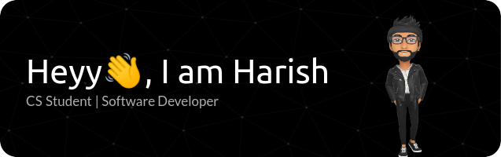

<div style="width:100%">

</div>

<br/>

<div align="center" style="width:100%;">
<div>
    <a href="https://harish-balaji.vercel.app/" target="_blank">
      
    </a>
    <a href="https://www.linkedin.com/in/harish-b-42a7911b9/" target="_blank">
      
    </a>
    <a href="mailto:harishbalaji369@gmail.com" target="_blank">
      
    </a>
    <a href="https://medium.com/@harishbalaji369" target="_blank">
      
    </a>
</div>
</div>

<br/>

### A little bit more about me...

```javascript
const harish = {
  pronouns: "He" | "his",
  country: "India",
  role: "Student" && "Intern",
  code: ["Java", "Javascript", "HTML", "CSS", "Go", "C++", "Python"],
  frameworks: [ "NextJS", "ReactJS", "Typescript", "NodeJS" ],
  others: [ "PostgreSQL", "AWS", "MongoDB", "Firebase", "Docker", "Kubernetes", "TailwindCSS", "RestAPI", "Figma", "Git" ],
  workingOn: [ "Personal_Projects", "Softskills", "Contributions" ],
  lookingFor: [ "Contributing_to_Open-Source", "Internships" ]
}
```

<br/>

<h3>Some Stats</h3>

<div align="center">
    
    <br/>
    <br/>
    
</div>

<p>
     
    <em>
        <b>
            I love connecting with different people
        </b> 
            so if you want to say 
        <b>
            hi, I'll be happy to meet you!
        </b> :)</em></p>

#### Lets connect:

[](https://www.linkedin.com/in/harish-b-42a7911b9//)

---

<sub>Note: This Readme template was derived from</sub> [<sub>Thariane's</sub>](https://github.com/Thaiane)
