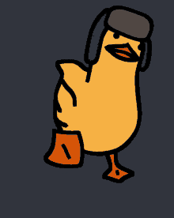

<h2> Hi, I'm Harish!! </h2>
<p><em>Studying Computer Science <div>Debugging my Life</div>
</em></p>


- 👯 Just started my journey in Open-Source 
- 😇 Actively contributing to Async API in docs
- ⏭️ Planning to contribute (in code) for Async API
- 🌱 I’m currently learning:   ML, Cloud and DevOps Practices

<br/>

### A little more about me...  

```javascript
const harish = {
  pronouns: "He" | "his",
  country: India,
  role: Student,
  code: [ C++, Javascript, HTML, CSS, Go, Java ],
  tools: [ React, Node, Docker, Kubernetes ],
  databases: [ "Firebase", "MongoDB"],
  
  learning: [ Cloud, ML],
  workingOn: { "Personal_Projects", "Softskills", "AsyncAPI docs"},
  
  lookingFor: "Contributing_to_Open-Source", "Internships"
}
```
<br/>
<br/>

<p> <em><b>I love connecting with different people</b> so if you want to say <b>hi, I'll be happy to meet you!</b> :)</em></p>


#### Lets connect: 
[](https://www.linkedin.com/in/harish-b-42a7911b9//)

---


<sub>Note: This Readme template was derived from</sub> [<sub>Thariane's</sub>](https://github.com/Thaiane)
